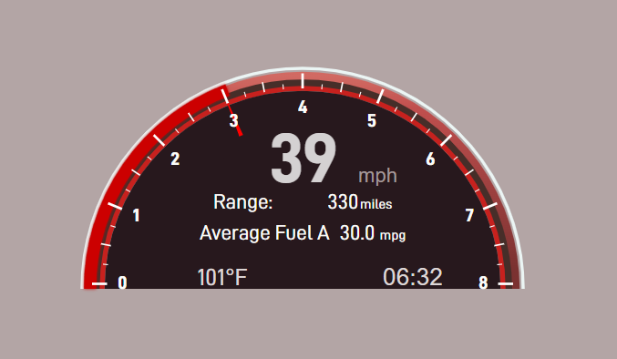
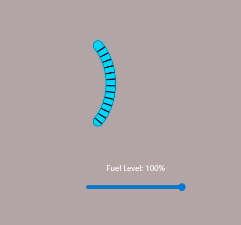

# WebAssembly Engine & Custom Telemetry Dashboard

A high-performance, real-time vehicle instrument cluster built using a **C++ simulation backend** compiled to **WebAssembly (WASM)**, seamlessly integrated with a responsive **React frontend**. 

The architecture enforces a strict separation of concerns: vehicle physics, fuel consumption dynamics, and rolling efficiency calculations run natively at 60 FPS in C++, while React operates purely as a stateless presentation layer utilizing high-performance SVG rendering.

## Project Showcases

### Main Instrument Cluster Layout

*Featuring a radial tachometer sweep (0-8000 RPM), central digital speedometer readout, localized environment widgets, and dynamic distance-to-empty tracking.*

### Diagnostic Controls & Fuel Telemetry

*Real-time hardware emulation interface allowing granular tracking of raw fuel levels mapped directly to native C++ state variables.*

---

## Architectural Highlights

### 1. Embedded C++ Core Lifecycle (`Car.h`)
The heart of the simulation runs in native C++. Vehicle physics parameters, mass configurations, and fluid capacities are centralized within `Constants.h`. The engine state is driven through a time-slice loop:
* **Deterministic Tracking:** Uses a uniform real distribution via `std::mt19937` (Mersenne Twister) to simulate fuel efficiency variance over fixed operational intervals.
* **Native Memory Management:** Exposes structural byte arrays directly to JavaScript via Emscripten bindings, maximizing performance by eliminating typical garbage collection overhead found in standard web apps.

### 2. High-Frequency Telemetry Interfacing
The React layer leverages custom hooks to pipe data bi-directionally down the tree:
* **`useFuelSystem`**: Acts as the dedicated bridge to the WebAssembly memory registers, managing state mapping and handling user interaction events via an optimized execution pipeline.
* **`useAnimationFrame`**: Drives the core application loop. By binding the C++ `.tick(deltaTime)` updates directly to the browser's native rendering frames via `requestAnimationFrame`, the physics engine pauses automatically when the browser tab loses focus, conserving CPU cycles.

### 3. Stateless Presenter Components (`MileRange.jsx`)
The user interface components are fully decoupled from calculation logic. They receive pre-computed, structured props straight from the C++ telemetry payload:
* Zero calculation drift or structural desynchronization between different sections of the dashboard.
* Layout anchoring optimizes SVG text baselines natively, ensuring stable rendering during rapid telemetry updates.

---

## Technical Stack
* **Systems Core:** C++17, Emscripten (WASM Compiler)
* **Frontend UI:** React, Modern JavaScript (ES6+), SVG Data Articulation, HTML5 Canvas Elements
* **Styling Engine:** Custom CSS3 layout systems using dark-mode optimization palettes